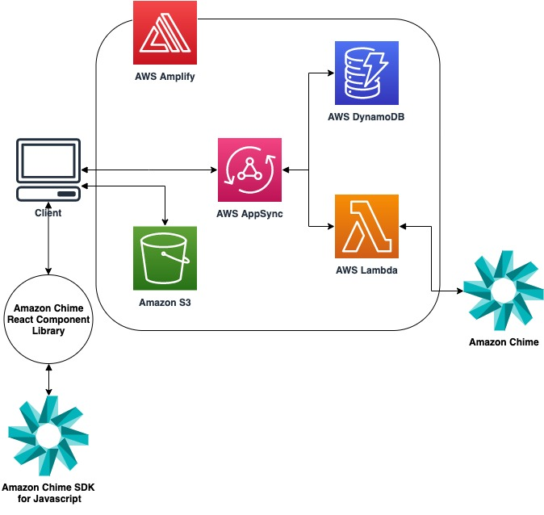

# Amazon Chime SDK Amplify Demo

The Amazon Chime SDK Amplify Demo shows how to use AWS Amplify to quickly create all of the required backend resources for an application using the Amazon Chime SDK. 

## Architecture Overview



## Prerequisites
+ [AWS Account](https://aws.amazon.com/resources/create-account/)

+ [Node.js v12+](https://nodejs.org/en/download/) with [NPM 6.11+](https://docs.npmjs.com/getting-started/installing-node)

+ [AWS Ampify CLI](https://aws-amplify.github.io/)
  - `npm install -g @aws-amplify/cli`

## Getting Started

### Initialize Amplify in your project

1. At the root level of your application directory, install Amplify:
    ```
    npm install --save-dev aws-amplify
    ```
2. Configure your Amplify project
    ```
    amplify configure
    ```

3. Initialize Amplify inside of your project’s root directory. This creates a local Amplify environment, where the configurations for your generated backend resources exist.

    ```
    $ amplify init

    ? Enter a name for the project: (amplifyDemo) 
    ? Enter a name for the environment: dev 
    ? Choose your default editor: Visual Studio Code
    ? Choose the type of app that youre building: javascript 
    ? What JavaScript framework are you using: React
    ? Source Directory Path: src 
    ? Distribution Directory Path: dist 
    ? Build Command: npm run-script build
    ? Start Command: npm run-script start 
    ? Do you want to use an AWS profile? Yes 
    ? Please choose the profile you want to use [Your AWS Profile] <- Choose the AWS Profile configured in the previous step
    ```

### Generate backend resources using Amplify CLI

Amplify provides a CLI command to generate a predefined group of backend resources, referred to as a “category”. In this section, the `api` and `function` categories are used to generate our application backend. 

First, create the `function` category using the Amplify CLI. This command creates a directory inside `./amplify/backend/{functionName}` where you can define the implementation of a Lambda function. Amplify also generates the AWS CloudFormation template required in order to deploy the Lambda function to your AWS account.

Next, create the `api` category. Amplify automatically creates a GraphQL-based API using AWS AppSync behind the scenes. Amplify generates all of the CloudFormation templates to create these resources in your AWS account. The `schema.graphql` file defines which APIs are required - and what their definitions are.

Lastly, use the Amplify CLI to push these configurations up to your AWS account. Amplify then reads the configurations for each category that you added and generate the corresponding resources in your AWS account. Note that none of the changes are be visible in your AWS account until you complete this step. Any further updates to your local Amplify environment can be updated in your AWS account by repeating this `amplify push` step. 

#### 1. Create a Lambda in your local Amplify environment using the Amplify CLI. 
This Lambda acts as a resolver for your APIs, meaning that AWS AppSync sends the GraphQL API requests to this Lambda. The Lambda contains code to handle different GraphQL API requests and returns a response to your client application. Run the command below and answer the prompts as shown below: 
    
> ⚠️ Important: Make sure to use the name `reactSampleLambda` for the purpose of this demo. You may choose a different name, but make sure the name matches the name of the Lambda function defined in `schema.graphql`.

```
$ amplify add function

? Select which capability you want to add: Lambda function (serverless function)
? Provide an AWS Lambda function name: reactSampleLambda 
? Choose the runtime that you want to use: NodeJS
? Choose the function template that you want to use: Hello World
? Do you want to configure advanced settings? No
? Do you want to edit the local lambda function now? Yes
```

  When asked “Do you want to edit the local lambda function now?,” answer ‘Yes’ and replace the `./amplify/backend/function/reactSampleLambda/src/index.js` with the provided code in `./lambda/index.js`.

#### 2. Create an AWS AppSync API using Amplify CLI. 
Run the command below and answer the prompts as shown below::

  ```
  $ amplify add api

  ? Please select from one of the below mentioned services: GraphQL
  ? Provide API name: reactSampleApi
  ? Choose the default authorization type for the API: API key
  ? Enter a description for the API key:
  ? After how many days from now the API key should expire (1-365): 7
  ? Do you want to configure advanced settings for the GraphQL API No, I am done.
  ? Do you have an annotated GraphQL schema? Yes
  ```

  When prompted for the schema.graphql “Do you have an annotated GraphQL schema?” - answer yes. Then, provide the file path to schema.graphql. (If you just cloned the repo and are running this command at the root level of this repo, you can just put `schema.graphql`).

#### 3. Create the cloud resources in your AWS account by running the following command. 
This updates your cloud resources based on your current local environment’s Amplify configuration. Select all of the default options by pressing enter for each prompt. When asked if you’d like to continue, answer ‘yes'.

  ```
  amplify push
  ```

#### 4. Modify IAM Role policy to include Amazon Chime Full Access in order to allow your Lambda function to call Amazon Chime APIs, such as createMeeting and deleteMeeting:
    1. Navigate to the AWS Console using the same account that you used to configure amplify. 
    2. Navigate to IAM
    3. Click on Roles in the side menu. 
    4. Find the role created and click on the name of the Role -  reactSampleLambdaRole-XXX-{environment}
    5. Click on the “Attach Policies” button
    6. Type in the search box: AmazonChimeFullAccess
    7. Click on the checkbox for: AmazonChimeFullAccess
    8. Click on “Attach Policy” at the bottom right of the screen


#### 5. From here, you can now run the meeting client locally. To do so, navigate to the repo’s root level directory and run this command:

  ```
  npm install && npm run build && npm run start
  ```

#### 6. Optional: Hosting your application using Amplify 

You can use Amplify to set up a S3 bucket and CloudFormation stack to host your application in just a few minutes. 

Add the hosting category from the Amplify CLI:

  ```
  $ amplify add hosting

  ? Select the plugin module to execute: Amazon CloudFront and S3
  ? Select the environment setup: PROD (S3 with CloudFront using HTTPS)
  ? hosting bucket name: <Default Value>
  ```
Then, publish your changes to the cloud:

  ```
  amplify publish
  ```

Once finished, navigate to the endpoint that is generated to try the server-less application.
