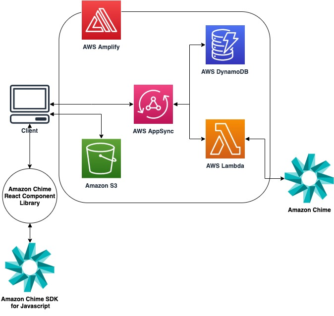

# Amazon Chime SDK Amplify Demo

The Amazon Chime SDK Amplify Demo shows how to use AWS Amplify to quickly create all of the required backend resources for an application using the Amazon Chime SDK. 

## Architecture Overview



## Prerequisites
+ [AWS Account](https://aws.amazon.com/resources/create-account/)

+ [Node.js v12+](https://nodejs.org/en/download/) with [NPM 6.11+](https://docs.npmjs.com/getting-started/installing-node)

+ [AWS Ampify CLI](https://aws-amplify.github.io/)
  - `npm install -g @aws-amplify/cli`

## Getting Started

### Initialize Amplify in your project

1. At the root level of your application directory, install Amplify:
    ```
    npm install --save-dev aws-amplify
    ```
2. Configure your Amplify project
    ```
    amplify configure
    ```

3. Initialize Amplify inside of your project’s root directory. This creates a local Amplify environment, where the configurations for your generated backend resources exist.

    ```
    $ amplify init

    ? Enter a name for the project: (amplifyDemo) 
    ? Enter a name for the environment: dev 
    ? Choose your default editor: Visual Studio Code
    ? Choose the type of app that youre building: javascript 
    ? What JavaScript framework are you using: React
    ? Source Directory Path: src 
    ? Distribution Directory Path: dist 
    ? Build Command: npm run-script build
    ? Start Command: npm run-script start 
    ? Do you want to use an AWS profile? Yes 
    ? Please choose the profile you want to use [Your AWS Profile] <- Choose the AWS Profile configured in the previous step
    ```

### Generate backend resources using Amplify CLI

Amplify provides a CLI command to generate a predefined group of backend resources, referred to as a “category”. In this section, the `api` and `function` categories are used to generate our application backend. 

First, create the `function` category using the Amplify CLI. This command creates a directory inside `./amplify/backend/{functionName}` where you can define the implementation of a Lambda function. Amplify also generates the AWS CloudFormation template required in order to deploy the Lambda function to your AWS account.

Next, create the `api` category. Amplify automatically creates a GraphQL-based API using AWS AppSync behind the scenes. Amplify generates all of the CloudFormation templates to create these resources in your AWS account. The `schema.graphql` file defines which APIs are required - and what their definitions are.

Lastly, use the Amplify CLI to push these configurations up to your AWS account. Amplify then reads the configurations for each category that you added and generate the corresponding resources in your AWS account. Note that none of the changes are be visible in your AWS account until you complete this step. Any further updates to your local Amplify environment can be updated in your AWS account by repeating this `amplify push` step. 

#### 1. Create a Lambda in your local Amplify environment using the Amplify CLI. 
This Lambda acts as a resolver for your APIs, meaning that AWS AppSync sends the GraphQL API requests to this Lambda. The Lambda contains code to handle different GraphQL API requests and returns a response to your client application. Run the command below and answer the prompts as shown below: 
    
> ⚠️ Important: Make sure to use the name `reactSampleLambda` for the purpose of this demo. You may choose a different name, but make sure the name matches the name of the Lambda function defined in `schema.graphql`.

```
$ amplify add function

? Select which capability you want to add: Lambda function (serverless function)
? Provide an AWS Lambda function name: reactSampleLambda
? Choose the runtime that you want to use: NodeJS
? Choose the function template that you want to use: Hello World

Available advanced settings:
- Resource access permissions
- Scheduled recurring invocation
- Lambda layers configuration
- Environment variables configuration
- Secret values configuration

? Do you want to configure advanced settings? (y/N) No
? Do you want to edit the local lambda function now? Yes
```

  When asked “Do you want to edit the local lambda function now?,” answer ‘Yes’ and replace the `./amplify/backend/function/reactSampleLambda/src/index.js` with the provided code in `./lambda/index.js`.

#### 2. Create an AWS AppSync API using Amplify CLI. 
Run the command below and answer the prompts as shown below::

  ```
  $ amplify add api

? Select from one of the below mentioned services: GraphQL
? Here is the GraphQL API that we will create. Select a setting to edit or continue Name: amplifydemo
? Provide API name: reactSampleApi
? Here is the GraphQL API that we will create. Select a setting to edit or continue Continue
? Choose a schema template: Blank Schema

⚠️  WARNING: your GraphQL API currently allows public create, read, update, and delete access to all models via an API Key. To configure PRODUCTION-READY authorization rules, review: https://docs.amplify.aws/cli/graphql/authorization-rules

GraphQL schema compiled successfully.
✔ Do you want to edit the schema now? (Y/n) · yes
  ```

  When prompted for the schema.graphql “Do you want to edit the schema now?” - answer yes. Then, copy the content from amplify-demo/schema.graphql in this repo to `/<path-to-aplify-demo>/amplify/backend/api/reactSampleApi/schema.graphql`).

#### 3. Create the cloud resources in your AWS account by running the following command. 
This updates your cloud resources based on your current local environment’s Amplify configuration.

  ```
$ amplify push

⠏ Fetching updates to backend environment: dev from the cloud.
⚠️  WARNING: your GraphQL API currently allows public create, read, update, and delete access to all models via an API Key. To configure PRODUCTION-READY authorization rules, review: https://docs.amplify.aws/cli/graphql/authorization-rules

GraphQL schema compiled successfully.

Edit your schema at /<path-to-amplify-demo>/amplify/backend/api/reactSampleApi/schema.graphql or place .graphql files in a directory at /<path-to-amplify-demo>/amplify/backend/api/reactSampleApi/schema
✔ Successfully pulled backend environment dev from the cloud.
⠹ Building resource api/reactSampleApi
⚠️  WARNING: your GraphQL API currently allows public create, read, update, and delete access to all models via an API Key. To configure PRODUCTION-READY authorization rules, review: https://docs.amplify.aws/cli/graphql/authorization-rules

GraphQL schema compiled successfully.

Edit your schema at /<path-to-amplify-demo>/amplify/backend/api/reactSampleApi/schema.graphql or place .graphql files in a directory at /<path-to-amplify-demo>/amplify/backend/api/reactSampleApi/schema

    Current Environment: dev
    
┌──────────┬───────────────────┬───────────┬───────────────────┐
│ Category │ Resource name     │ Operation │ Provider plugin   │
├──────────┼───────────────────┼───────────┼───────────────────┤
│ Function │ reactSampleLambda │ Create    │ awscloudformation │
├──────────┼───────────────────┼───────────┼───────────────────┤
│ Api      │ reactSampleApi    │ Create    │ awscloudformation │
└──────────┴───────────────────┴───────────┴───────────────────┘
? Are you sure you want to continue? (Y/n) y
.
.
.
? Do you want to generate code for your newly created GraphQL API Yes
? Choose the code generation language target typescript
? Enter the file name pattern of graphql queries, mutations and subscriptions src/graphql/**/*.ts
? Do you want to generate/update all possible GraphQL operations - queries, mutations and subscriptions Yes
? Enter maximum statement depth [increase from default if your schema is deeply nested] 2
? Enter the file name for the generated code src/API.ts
  ```

  This will end with success output providing generated GraphQL endpoint and API KEY.

#### 4. Modify IAM Role policy to include Amazon Chime Full Access in order to allow your Lambda function to call Amazon Chime APIs, such as createMeeting and deleteMeeting:
  1. Navigate to your account under AWS CloudFormation stacks and choose "amplify-<your-demo-name>-dev-*".
  2. Under "Resources" Choose the Physical ID link against "functionreactSampleLambda" (function<name provided when you executed amplify add function>).
  3. A nested stack will open and again choose "Resources".
  4. Choose the Physical ID link in front of "LambdaExecutionRole". This will take you to the lambda execution role in IAM.
  5. Choose the “Attach Policies” button
  6. Type in the search box: AmazonChimeFullAccess
  7. Choose the checkbox for: AmazonChimeFullAccess
  8. Choose “Attach Policy” at the bottom right of the screen


#### 5. From here, you can now run the meeting client locally. To do so, navigate to the repo’s root level directory and run this command:

  ```
  npm install && npm run build && npm run start
  ```

#### 6. Optional: Hosting your application using Amplify 

You can use Amplify to set up a S3 bucket and CloudFormation stack to host your application in just a few minutes. 

Add the hosting category from the Amplify CLI:

  ```
  $ amplify add hosting

  ? Select the plugin module to execute: Amazon CloudFront and S3
  ? Select the environment setup: PROD (S3 with CloudFront using HTTPS)
  ? hosting bucket name: <Default Value>
  ```
Then, publish your changes to the cloud:

  ```
  amplify publish
  ```

Once finished, navigate to the endpoint that is generated to try the server-less application.
