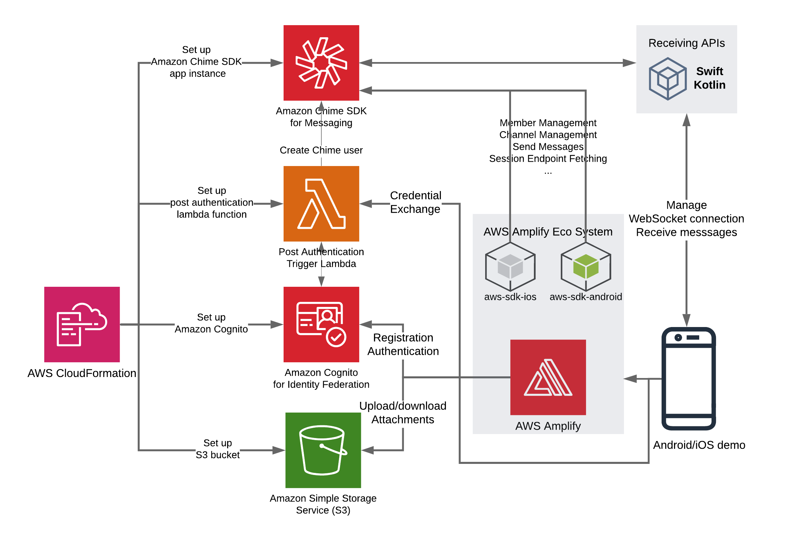

# Amazon Chime SDK Android Chat Demo

## Overview

By completing the steps below, you will learn how to run the Amazon Chime SDK Android chat demo applications on your mobile device or on a simulator. This application enables users to send and receive messages/image attachments in chat channels in real time. This application is designed in a way that can be used as a starting point for your own application, or as a quick way to explore the features of the Amazon Chime SDK messaging. Please see the [Build chat applications in iOS and Android with Amazon Chime SDK messaging](https://aws.amazon.com/blogs/business-productivity/build-chat-applications-in-ios-and-android-with-amazon-chime-sdk-messaging) for more information.

<p align="center">

</p>

## Prerequisites

1. You have read [Build chat features into your application with Amazon Chime SDK messaging](https://aws.amazon.com/blogs/business-productivity/build-chat-features-into-your-application-with-amazon-chime-sdk-messaging/). You understand the architecture of the chat demo web application built with Amazon Chime SDK messaging. 
2. You have completed the following operations
    1. [Deploy the solution](https://github.com/aws-samples/amazon-chime-sdk/tree/main/apps/chat#deploying-the-solution).
    2. [Run the Amazon Chime SDK Chat Demo](https://github.com/aws-samples/amazon-chime-sdk/tree/main/apps/chat#running-the-amazon-chime-sdk-chat-demo).
    3. [Create Amazon Cognito Users](https://github.com/aws-samples/amazon-chime-sdk/tree/main/apps/chat#cognito-user-pools) OR [Use Credential Exchange Service](https://github.com/aws-samples/amazon-chime-sdk/tree/main/apps/chat#credential-exchange-service) to join a chat session.
3. You have installed Android Studio version 4.0 or later.

## Build and Run Android Chat Demo Application
1. Clone the project from Github.
   ```
   git clone https://github.com/aws-samples/amazon-chime-sdk.git
   ```
2. Navigate to the root folder of the Android chat demo application.
   ```
   cd apps/chat-android
   ```
3. Open the project in Android Studio.
4. Open `app/src/main/res/raw/amplifyconfiguration.json` and update the configuration with the values from outputs from the deployment of AWS CloudFormation template.
5. Open `app/src/main/java/com/amazonaws/services/chime/sdkdemo/common/AppConstants.kt` and update `APP_INSTANCE_ARN` and `API_GATEWAY_INVOKE_URL`.
   ```
    const val APP_INSTANCE_ARN = "<appInstanceArn from CloudFormation Outputs>"
    const val API_GATEWAY_INVOKE_URL = "<apiGatewayInvokeUrl from CloudFormation Outputs>"
   ```
6. Run the application on a simulator or a physical device. Sign in with `username` and `password` of desired Amazon Cognito user or via Credential Exchange Service.