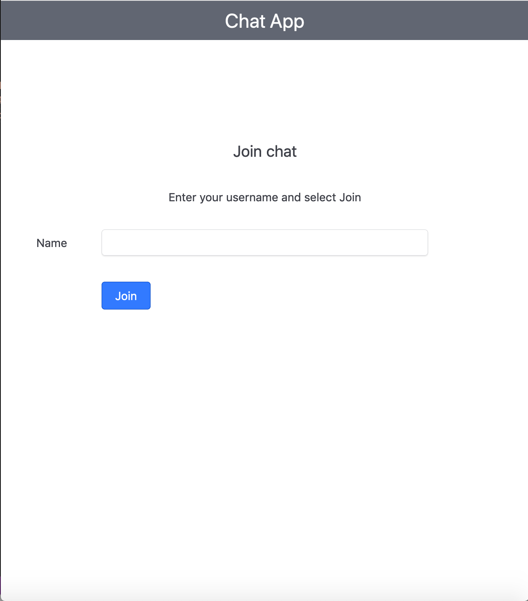
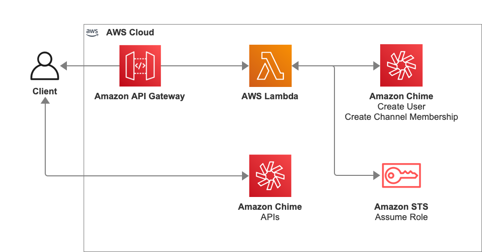
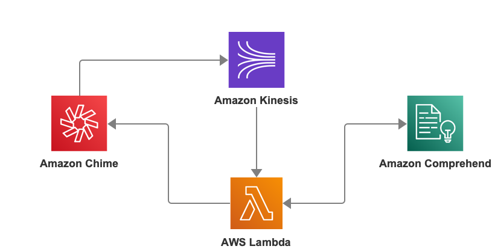
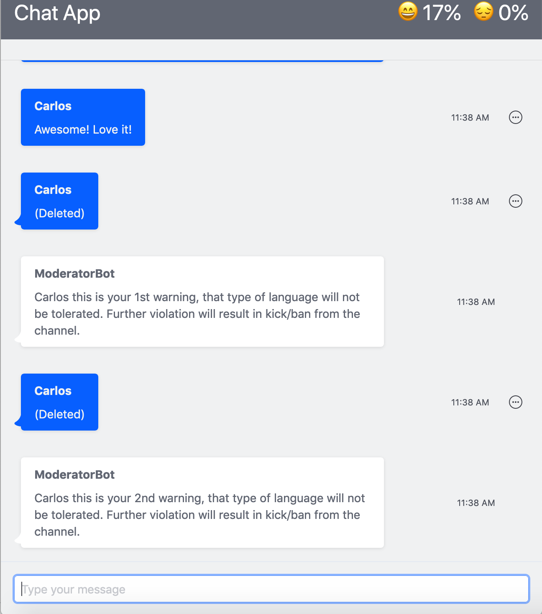
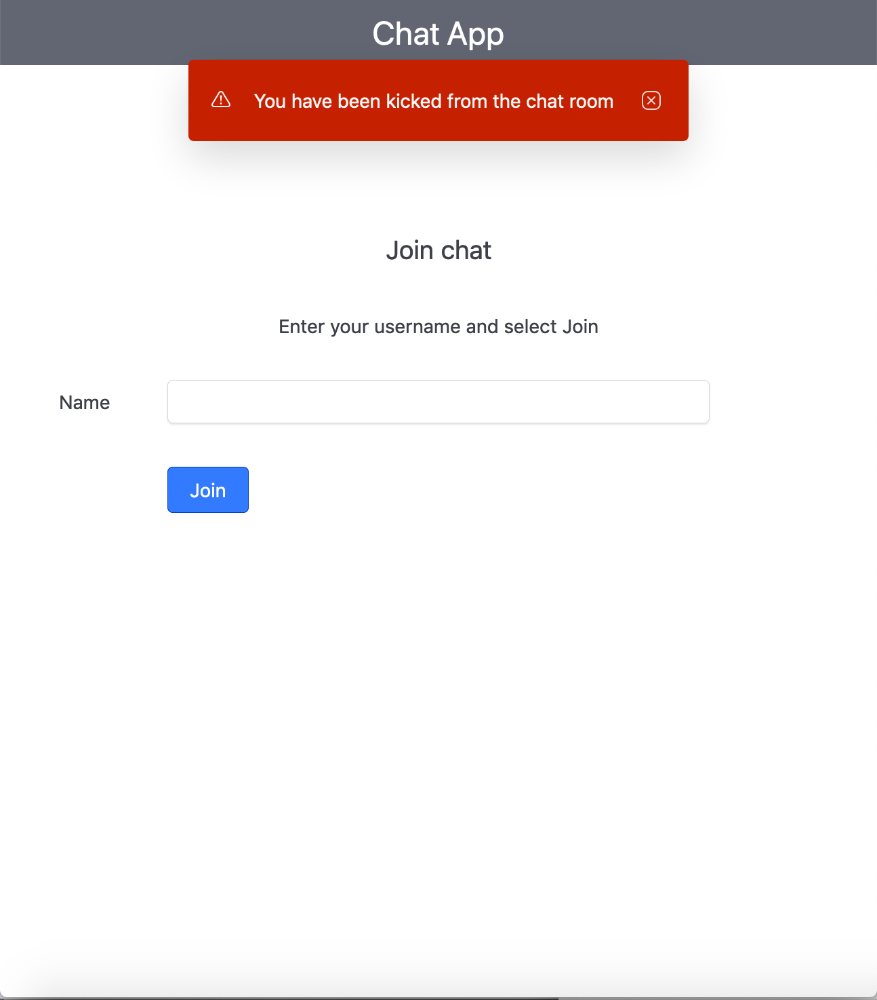
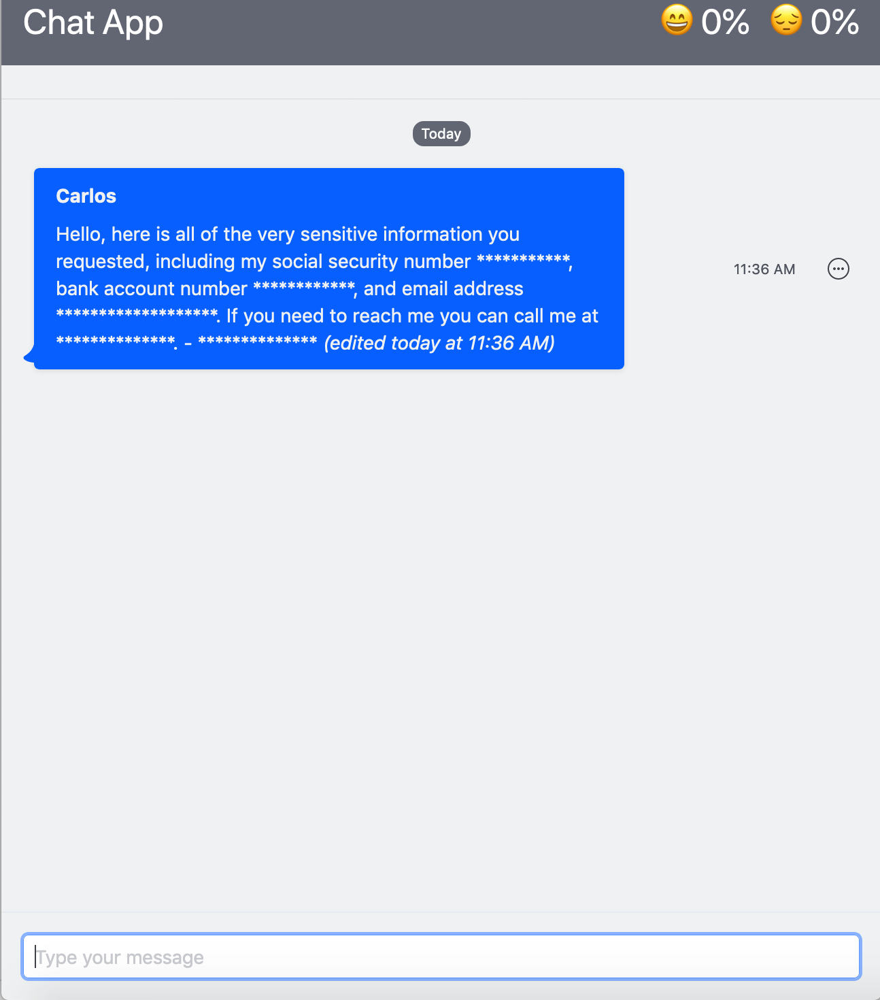
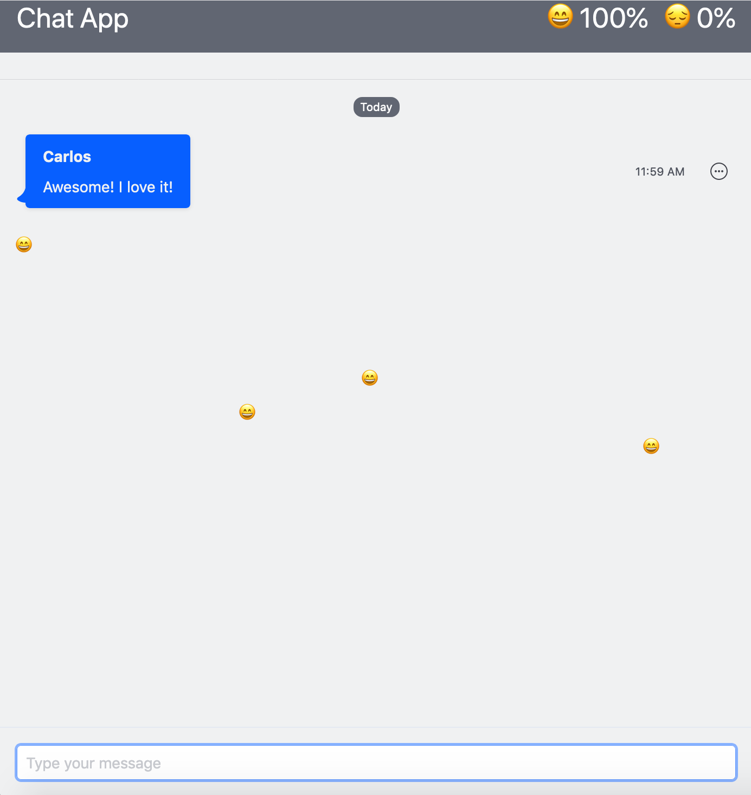

# Automated Moderation and Sentiment Analysis of Chat with the Amazon Chime SDK

Live event organizers need to communicate in large streaming events, live streamed product demonstration, or keynote
speech at a conference over multiple modalities, including video and chat. However, existing chat solutions often do
not scale to support tens of thousands of participants. Amazon Chime SDK messaging is secure, persistent, and can scale up to 100k members in a single chat channel. 

In this post, you will learn how to use the Amazon Chime SDK to create a chat application that can be used alongside a live-stream broadcast. This application includes commonly requested features for this use case, including automated moderation, message effects, and sentiment analysis.
We will start with a brief overview of the components of the demo application, then provide steps to deploy the demo, followed by a description of each of the applications features.

For this walk-through, you should have the following pre-requisites:

* [AWS CLI](https://aws.amazon.com/cli/).
* [Node 14](https://docs.npmjs.com/downloading-and-installing-node-js-and-npm) or higher.
* NPM 7 or higher.


## Application Architecture

This application includes a basic chat interface for a single channel with unauthenticated users. For a more feature-rich chat front-end, you can take the same backend functionality and apply it the chat demo application from [the messaging launch blog](https://aws.amazon.com/blogs/business-productivity/build-chat-features-into-your-application-with-amazon-chime-sdk-messaging/). 

There are 7 key components of this architecture:

1. Amazon Chime App Instance - A container for Amazon Chime SDK messaging. Settings such as retention policies and streaming export of messaging data through Amazon Kinesis are set at the app instance level. 
2. Within the App Instance, you have
    1. App Instance Moderator Bot - This is the user used in the AWS Lambda functions to perform moderation and
     administration actions such as sending messages warning about use of profanity, redacting sensitive content, and sending control messages with sentiment. 
    2. A single channel - With this simplified UI, a single channel is created, and only that channel is displayed in the interface. 
    3. Users - Users are created by the user creation Lambda after they enter their name
3. Amazon API Gateway - Connects the client to the user creation Lambda
4. Create Chat User Lambda - Creates a user and adds them to the chat channel
5. Amazon Kinesis Data Stream - Exports chat data into the AWS Lambda function for processing.
6. Message Processing Lambda - Processes messages, scanning for profanity, and integrating with Amazon Comprehend
7. Amazon Comprehend - Amazon Comprehend is used for sentiment analysis and detection of personally identifiable information (PII)

## Deploying the Demo Application

### Step 1. Setup the Chime SDK messaging instance for the demo

1. Sign in to the AWS Management Console with your primary account. Switch to the us-east-1 (N. Virginia) Region. Note: The AWS CloudFormation template in this section needs to be launched in US east (N. Virginia) Region.
2. Deploy included CloudFormation template via [CloudFormation Console](https://aws.amazon.com/cloudformation/) or
       
   ```
    aws cloudformation create-stack --stack-name <STACKNAME> --template-body file://backend/template.yaml --parameters ParameterKey=DemoName,ParameterValue=<NAME_OF_DEMO> --capabilities CAPABILITY_NAMED_IAM
   ```
3. Creating the stack generates 4 outputs- createUserApiGatewayURL, appInstanceArn, adminUserArn and channelArn. Note
 these values for the demo app configuration in the next step.

### Step 2. Deploy the Amazon Chime SDK automated moderation demo app locally

1. Run the following commands to install all the dependencies 
 
    ```npm install```
2. Edit src/Config.js with the outputs from the AWS CloudFormation stack from Step 1
3. Once the configuration for the application is entered, run the following command to set up your front-end server locally.
 
    ```npm run start```

## Authentication

The **chat application** introduces a simple process for granting users access to a channel. This is great for use cases where you want users to be able to access a channel quickly, even when they don’t have a user account. 



While this example is simple, it begins to show some of the power of authentication in Amazon Chime SDK messaging. In this flow, you as a developer control exactly how users access a channel, and can scope down access as you see fit by simply editing the IAM policy for the user role. 

For example, in this flow you may want to tag this user as a guest to limit the users access to a single channel with a condition in the IAM policy, rather than any channel in the app instance. You can take this even further and limit what actions the user can take in the channel such as preventing them from listing the members of the channel or preventing them from sending messages making the channel read only. 

Of course, because Amazon Chime SDK messaging works with almost any identity provider, you can replace the AWS Lambda function shown in the diagram with your own IdP and eliminate guest access altogether, requiring all users to sign in. 



## Processing messages to detect PII or profanity

Moderation of user-generated content is a critical need for many chat use cases. Corporations need to prevent the accidental sharing of sensitive information, entertainment and social applications need to ensure community guidelines are met, and brands need to ensure that content shared by users fits their brand. 

However, automated detection of sensitive content is complex, requires unique skill sets, and is expensive to build. Human moderation requires significant human effort and does not scale. Amazon Comprehend removes many of the challenges for implementing automated detection of profanity and sensitive information such as Personally Identifiable Information (PII) while Amazon Chime SDK messaging provides features that enable integration with Amazon Comprehend to detect profanity, PII, and other undesired content. Amazon Chime SDK messaging also provides features including message editing, message redaction, removing (kicking) users out of channels, and banning users so that they cannot return. 

The pattern for processing messages for this demo utilizes streaming export of chat data with Amazon Kinesis. Messages streamed through Amazon Kinesis are then processed by an AWS Lambda function. 



Amazon Comprehend is used for detection of personally identifiable information (PII) and to determine sentiment. 

For profanity, the Lambda function simply uses a banned word list. This removes the power of Amazon Comprehend, but is sufficient for many use cases and does not require training Amazon Comprehend. If you choose, you can also use Amazon Comprehend for profanity, but you will need to train your own model. 
Once profanity is detected, a Lambda function is called using a bot with the app instance admin role to remove the content and at first notify the user that they will be kicked and banned if they continue. 


After the initial warning, this same process is used to again remove the content using the redact API, but this time the bot also removes the user and bans them from the channel. 



To implement detection of PII, the content of this stream is sent through the AWS Lambda function that processes messages and utilizes Amazon Comprehend to detect PII. Once PII detected, a Lambda function is called using a bot with the app instance admin role to edit the message, removing the sensitive content.



## Reactions

In modern chat applications users expect features like reactions, that allow them to react to content in real time. In some cases, this may be a reaction to content in the channel, in other cases it may be a chat participant reacting to content displayed elsewhere, such as broadcast video. Adding reactions that contribute to the shared experience of chat participants requires low-latency messaging that scales. 

Sentiment analysis of chat data has multiple uses. In our demo we show a basic example that ties in with the implementation of reactions, but the same concept can be used for different implementations. For a large channel, analysis of chat content could be one metric to determine the overall response to a product demonstration or keynote, with the possibility to identify individual users who were especially positive in their response. Outside of the context of a large chat room, this same type of analysis could be used in a dashboard to identify bad customer interactions such as when a customer is responding poorly to a conversation with a delivery driver. 

In this application, reactions and sentiment analysis follow the flow we have set up for detection of PII. Each
message is streamed through the Amazon Kinesis Data stream and into AWS Lambda, then to Amazon Comprehend, where the
sentiment is detected. When detected, a control message is sent down to the clients by the bot user with the sentiment which then triggers the display of the reaction. At the same time, the sentiment score at the top of the page is updated to account for the new message. If the message is positive, the positive score increases. If the message is negative, the negative score increases. If the message is neutral, both scores will drop since we are not accounting for neutral sentiment in the UI. 



This is just one implementation of a reaction. Amazon Comprehend again is optional here, if you simply want to detect specific words and react to them rather than sentiment you can include that list directly in the AWS Lambda function. This can be enhanced by adding additional types of reactions, counting the number of times a reaction is sent, etc. You can, of course, also choose to implement UI such as buttons to trigger these reactions, or allow users to react to messages in the channel. You as the developer have full control over the experience of your users. 

## Clean Up

If you don’t want to continue to be charged for the use of the chat demo application, you can clean up by deleting the AWS CloudFormation stack and resources created in the section for deploying the demo application.

To delete the stack and its resources:

1. From the AWS CloudFormation console in the region you used in the step 1, select the stack that you created.
2. Click Delete Stack.
3. In the confirmation message that appears, click Yes, Delete. At this stage, the status for your changes to DELETE_IN_PROGRESS. In the same way you monitored the creation of the stack, monitor its deletion by using the Events tab. When AWS CloudFormation completes the deletion of the stack, it removes the stack from the list.

## **Conclusion**

In this post, you learned how you can use the features of Amazon Chime SDK messaging alongside other AWS services including AWS Lambda and Amazon Comprehend to add auto-moderation to a chat channel that can be used alongside a broadcast video or in any use case where you have a large chat rooms that require moderation or sentiment analysis.

The Amazon Chime SDK messaging features are available today in the US East (N. Virginia) region at low per-message rates. To get started with Amazon Chime SDK messaging, read our [developer guide](https://docs.aws.amazon.com/chime/latest/dg/using-the-messaging-sdk.html).
