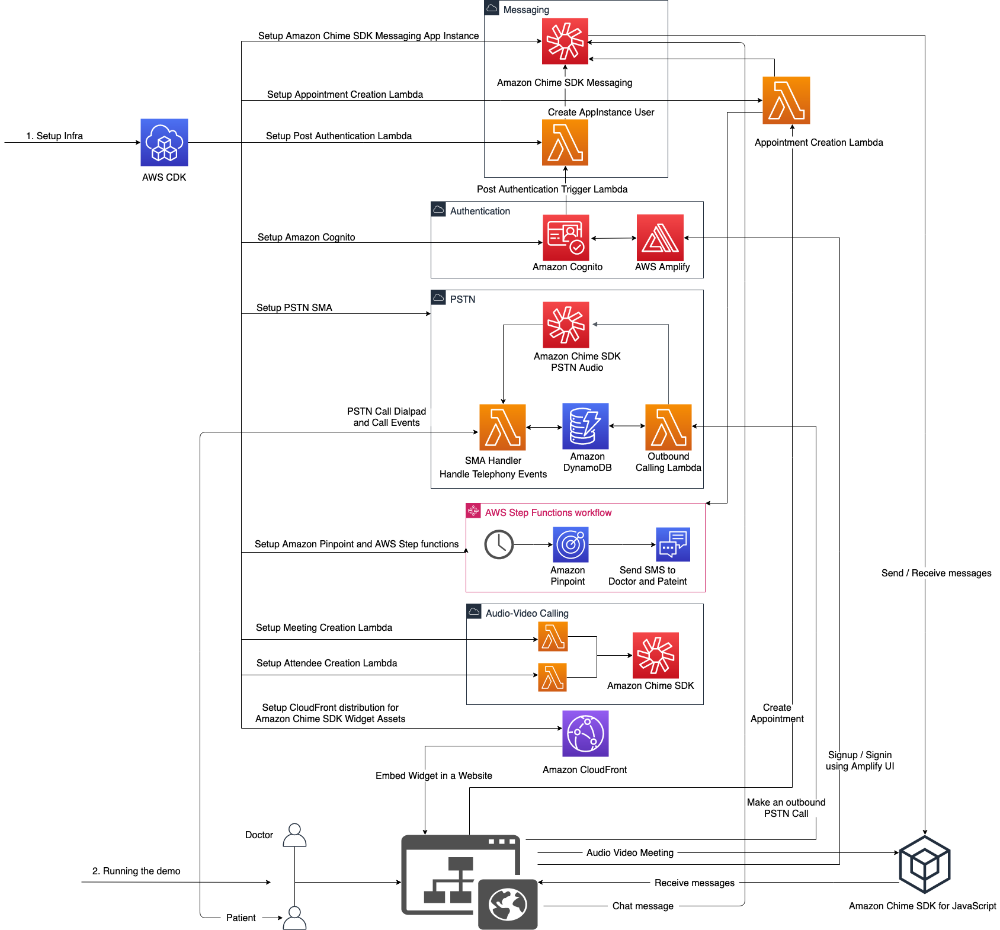
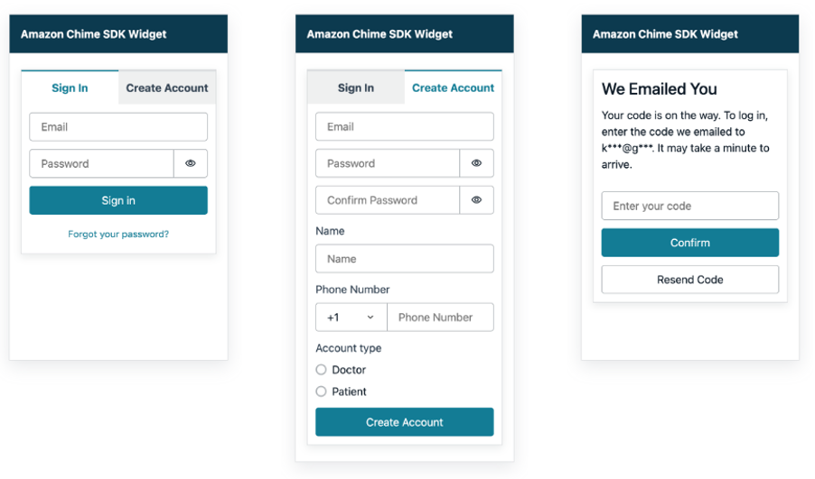
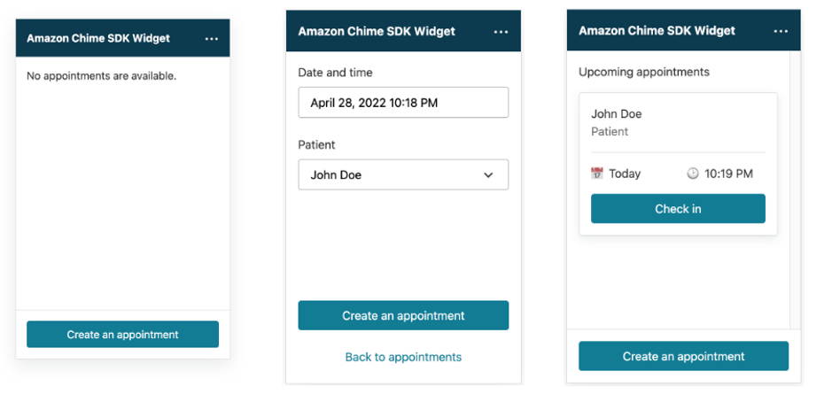
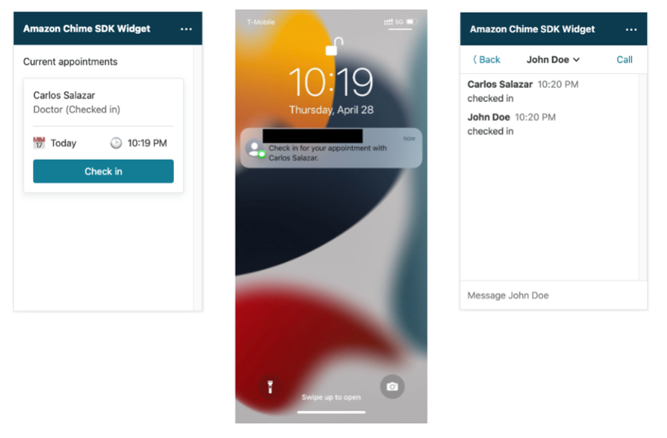
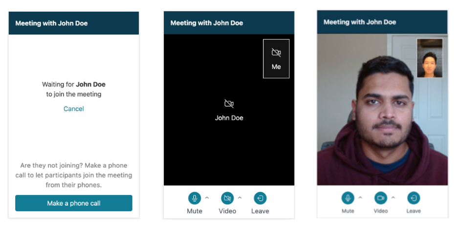
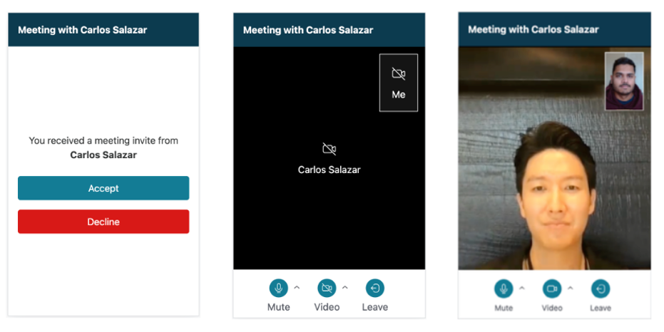
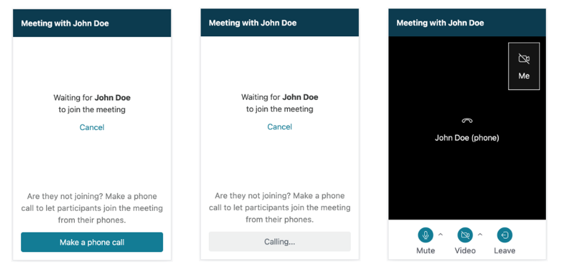
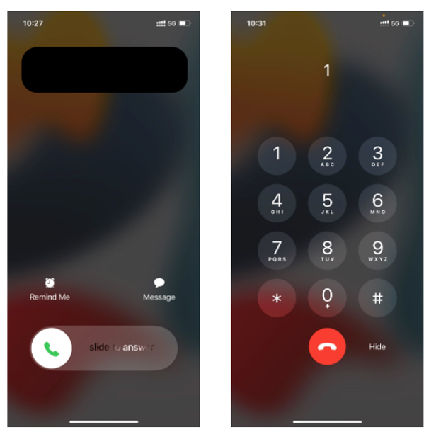
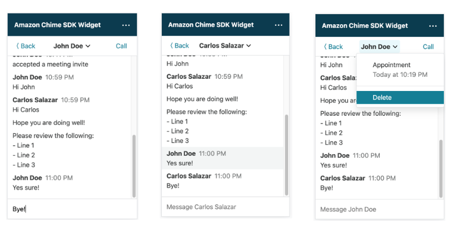

# Amazon Chime SDK Telehealth Widget Demo

The Amazon Chime SDK Telehealth Widget demo demonstrates various communication capabilities provided by Amazon Chime SDK. The demo showcases patient-doctor use cases with below user scenarios:

|User scenario|Service flow|
|--|--|
|A doctor and a patient sign up and sign in to the widget. |The solution uses [Amazon Cognito](https://aws.amazon.com/cognito/) for authentication and authorization. When the user signs up, the solution creates an Amazon Chime SDK `AppInstanceUser`.
|A doctor creates an appointment with a patient. |The solution creates an [Amazon Chime SDK messaging](https://docs.aws.amazon.com/chime-sdk/latest/dg/using-the-messaging-sdk.html) channel and adds two users as `ChannelModerator`. 
|A doctor and a patient view current and upcoming appointments. |The solution lists Amazon Chime SDK messaging channels moderated by the user.
|A doctor and a patient check in for an appointment. |The solution uses [Amazon Chime SDK messaging channel flows](https://docs.aws.amazon.com/chime/latest/dg/using-channel-flows.html) to set the user's presence status to "Checked in."
|A doctor and a patient join a video call. |The solution initiates an [Amazon Chime SDK meeting](https://docs.aws.amazon.com/chime/latest/dg/mtgs-sdk-mtgs.html) with two Amazon Chime SDK attendees.
|A patient receives an SMS notification if a patient has not checked in. |The solution uses [Amazon Pinpoint](https://aws.amazon.com/pinpoint/) to send an SMS notification.|
|A doctor and a patient join a meeting with a PSTN call. |The solution uses [Amazon Chime SDK PSTN Audio service](https://docs.aws.amazon.com/chime-sdk/latest/dg/build-lambdas-for-sip-sdk.html) to make a PSTN outbound call from doctor to patient.|

## Getting started

Ensure that you have configured your workstation with the default AWS credentials and an AWS region. Your default credentials should have the administrator permissions to deploy the stack and upload files to an Amazon S3 bucket. See [Getting started with the AWS CDK](https://docs.aws.amazon.com/cdk/v2/guide/getting_started.html#getting_started_prerequisites) if you have not configured so.

### Deploy

Deploy the **AmazonChimeSdkTelehealthWidgetDemo** stack using the default AWS profile and generate `dist/widget.js`. Deployment should complete within 5-10 minutes. See [FAQ](#faq) to learn more about the deployment command or troubleshoot issues.
```
cd ~/telehealth-widget
npm run deploy
```

### Running the demo

Embed the CSS and JS for widget from CloudFront in your website.
  
Step 1: Embed the CSS for widget from CloudFront.
```html
  <head>
    ...
    <!-- Embed the CSS for widget from CloudFront -->
    <link href="https://<Cloudfront-DistributionUrl>/index.css" rel="stylesheet" />
  </head>
```

Step 2: Embed the JavaScript for widget from CloudFront.
```html
<body>
  <!-- Embed the JS script for widget from CloudFront -->
  <script src="https://<Cloudfront-DistributionUrl>/index.js"></script>
</body>
```

Step 3: Load the widget in your website.
```html
<body>
  ...
  <script>
    window.initAmazonChimeSDKWidget();
  </script>
</body>
```

Now, run your website and you will see the widget embedded in your website.

### Sending appointment reminders via SMS

You can use the SMS channel in [Amazon Pinpoint](https://aws.amazon.com/pinpoint/) to send appointment reminders. To do so, you should request an origination phone number in your AWS account and add destination phone numbers for testing. Phone numbers are account-level resources, so they are not deleted when you delete the stack.

#### Step 1: Requesting an origination phone number

1. Open the [Amazon Pinpoint console](https://console.aws.amazon.com/pinpoint/).
1. Choose **AmazonChimeSdkTelehealthWidgetDemo**.
1. In the navigation pane, under **Settings**, choose **SMS and voice**.
1. Under **Phone numbers**, choose **Request phone number**.
1. On the **Define your phone numbers** page, do the following:
   1. Choose **United States** for **Country**.
   1. Choose the **Toll-Free**.
   1. Enable the **SMS** channel only. (Disable the **Voice** channel.)
   1. Choose **Transactional**.
   1. Choose **Next**.
1. On the **Review and request** page, confirm the phone number details and choose **Request**.
1. (Optional) Specify the phone number in the stack. You can skip this step because Amazon Pinpoint assigns one of the dedicated phone numbers and sends the SMS message from that phone number.
   1. Navigate to the `backend/lambda/src/send-sms-message.ts` file that contains an Amazon Lambda function to send SMS messages.
   1. Specify the phone number to the `ORIGINATION_PHONE_NUMBER` variable in E.164 format, as in the following example:
      ```
      const ORIGINATION_PHONE_NUMBER = '+12065550100';
      ```
   1. Navigate to the **backend** directory and update the **AmazonChimeSdkTelehealthWidgetDemo** stack with the latest changes.
      ```
      cd backend
      npm run deploy
      ```

#### Step 2: Adding destination phone numbers (SMS sandbox)

New AWS accounts that use the Amazon Pinpoint SMS are placed in sandbox environments. You can only send SMS messages to verified destination phone numbers in the sandbox. Do the following steps to add your users' phone numbers.

1. Open the [Amazon Pinpoint console](https://console.aws.amazon.com/pinpoint/).
1. Choose **AmazonChimeSdkTelehealthWidgetDemo**.
1. In the navigation pane, under **Settings**, choose **SMS and voice**.
1. Under the **Destination phone numbers** section, choose **Add phone number**.
1. Add your users' phone numbers for testing.

Now users with registered phone numbers will receive the appointment reminder via SMS if they are running late. To test the SMS feature, do the following:

1. Suppose you add a doctor and a patient's phone numbers as destination phone numbers in Amazon Pinpoint.
1. Create an appointment with a doctor and a patient.
1. Do not open this appointment.
1. Ensure that a doctor and a patient receive the appointment reminder via SMS at appointment time.


#### Step 3: Moving from the SMS sandbox to production

After testing the SMS feature in the SMS sandbox, you can request production access to send SMS messages to any phone number. To do so, follow the instructions in [Moving from the Amazon Pinpoint SMS sandbox to production](https://docs.aws.amazon.com/pinpoint/latest/userguide/channels-sms-awssupport-sandbox.html).


## Clean up

Deploying the stack may incur charges to your AWS account. Use the following steps to delete resources.
```
cd ~/telehealth-widget
npm run destroy
```

Following logs will be printed to terminal, please input 'y' when prompted to confirm deletion:
```
> chime-sdk-telehealth-widget-demo@1.0.0 destroy
> cd backend && npm run destroy


> chime-sdk-telehealth-widget--backend-demo@1.0.0 destroy
> cdk destroy

Are you sure you want to delete: AmazonChimeSdkTelehealthWidgetDemo (y/n)? y
AmazonChimeSdkTelehealthWidgetDemo: destroying...
 ✅  AmazonChimeSdkTelehealthWidgetDemo: destroyed
```

If any issue deleting the stack through command line, do the following to delete it from the AWS management console:

1. Open the [AWS CloudFormation console](https://console.aws.amazon.com/cloudformation/).
2. Delete the **AmazonChimeSdkTelehealthWidgetDemo** stack.
3. Delete the **CDKToolkit** stack if you do not use it for other CDK stacks. The deployment command runs the cdk bootstrap command to provision the **CDKToolkit** stack for storing templates and assets.


## Development

Amazon Chime SDK Telehealth Widget Demo consists of two packages: **frontend** and **backend**. The **frontend** package is a telehealth web application enabled by [Amazon Chime SDK React Component Library](https://github.com/aws/amazon-chime-sdk-component-library-react) and [AWS Amplify UI](https://ui.docs.amplify.aws/). The **backend** package is an AWS CDK stack to provision AWS resources for the web application.

### Frontend

The **frontend** package uses [Create React App](https://create-react-app.dev) for local development and [Parcel](https://parceljs.org) to output a single JavaScript and a single CSS file.

Navigate to the **frontend** directory and run the web application in development mode.

```
cd frontend
npm start
```

Upload the latest code to an Amazon S3 bucket and an Amazon CloudFront distribution in the **AmazonChimeSdkTelehealthWidgetDemo** stack.

```
npm run deploy
```

### Backend

Navigate to the **backend** directory and start the TypeScript compiler in "watch" mode to monitor changes in the `lib` directory.

```
cd backend
npm start
```

Update the **AmazonChimeSdkTelehealthWidgetDemo** stack with the latest changes.

```
npm run deploy
```

You can also use AWS CDK commands. For example, use the `cdk synth` command to emit the synthesized CloudFormation template and the `cdk diff` command to compare the local version with the already-deployed version.

```
npm install -g aws-cdk
cdk synth
cdk diff
```

⚠️ You must specify the `--outputs-file ../frontend/src/config.json` option to the `cdk deploy` command. The **frontend** package requires `config.json` to use output values, such as an Amazon S3 bucket name for distribution. `npm run deploy` runs the following command:

```
cdk deploy --outputs-file ../frontend/src/config.json
```

See [AWS CDK Workshop](https://cdkworkshop.com/) for more information.

Check **[How the demo works?](./HOW-THE-DEMO-WORKS.md)** for understanding the implementation details.

## FAQ

#### The deployment command (`npm run deploy`) failed. How can I troubleshoot deployment issues?

Use the following steps to identify which deployment step has an issue. Running `npm run deploy` command at the root directory performs the same steps in order.

1. Install local NPM dependencies.
   ```
   cd backend
   npm install
   ```
1. Install and deploy the AWS CDK Toolkit. For example, AWS CDK uses the toolkit to store templates and assets in an Amazon S3 bucket. Bootstrapping is a one-time operation per account per region.
   ```
   npm install -g aws-cdk
   cdk bootstrap
   ```
1. Deploy the **AmazonChimeSdkTelehealthWidgetDemo** stack. You must specify the `--outputs-file ../frontend/src/config.json` option to export stack outputs for the **frontend** package. Stack outputs include Amazon Chime SDK AppInstanceArn, distribution bucket name, and other AWS resource information.
   ```
   cdk deploy --outputs-file ../frontend/src/config.json
   ```
1. Build and upload the **frontend** package to an Amazon S3 bucket and an Amazon CloudFront distribution in the **AmazonChimeSdkTelehealthWidgetDemo** stack. This command also creates or updates the `dist/widget.js` file.
   ```
   cd ../frontend
   npm install
   npm run deploy
   ```

If you still experience issues, please create a GitHub issue.


#### I cannot see the widget in my application. Why is the widget behind other elements?

When you execute the content of `dist/widget.js` in your application, the script creates the `<div>` HTML element with the ID `amazon-chime-sdk-widget-container` and append it to the `<body>` HTML element.

```html
<body>
  <div class="my-application"></div>

  <!-- Appended to the end -->
  <div id="amazon-chime-sdk-widget-container">
    <!-- the widget -->
  </div>
</body>
```

The `amazon-chime-sdk-widget-container` uses the following CSS custom properties (variables) to set `z-index` to `9999` in `frontend/src/index.css`.

```css
:root {
  /* z-index */
  --chime-sdk-widget-z-index: 9999;
}

#amazon-chime-sdk-widget-container {
  z-index: var(--chime-sdk-widget-z-index);
}
```

Try adjusting the `--chime-sdk-widget-z-index` value and upload the latest code.

```
cd frontend
npm run deploy
```

See the next question if the `z-index` solution does not help.

#### Can I embed a widget in my HTML element?

Pass your HTML element after copying the content of `dist/widget.js` into your application.

```js
const container = document.getElementById('my-container');
window.initAmazonChimeSDKWidget(container);
```

Ensure that you set the `pointer-events` CSS property to `none`, so elements behind your container receive pointer events.

```css
#my-container {
  pointer-events: none;
}
```

If you do not specify any parameter to `window.initAmazonChimeSDKWidget()`, the demo creates the `<div>` HTML element with the ID `amazon-chime-sdk-widget-container`. Refer to style properties  `#amazon-chime-sdk-widget-container` in `frontend/src/index.css`.

#### Can I change the language used in the demo?

Yes, the demo supports localization using [i18next](https://www.i18next.com/) and [react-i18next](https://react.i18next.com/) internationalization frameworks. Follow the steps mentioned in `frontend/src/localization/index.ts` to support your language.

## Appendix A: Solution architecture



## Appendix B: Demo screenshots

### Sign in/Sign up



### Appointment



### Check-in and SMS notification



### Audio video call (Doctor)



### Audio video call (Patient)



### Phone call (Doctor)



### Phone call (Patient)



### Chat widget


