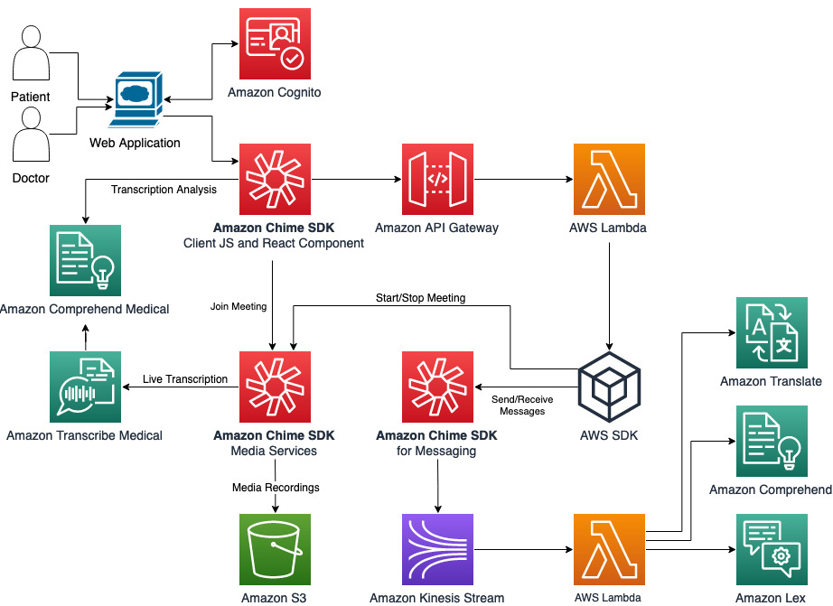
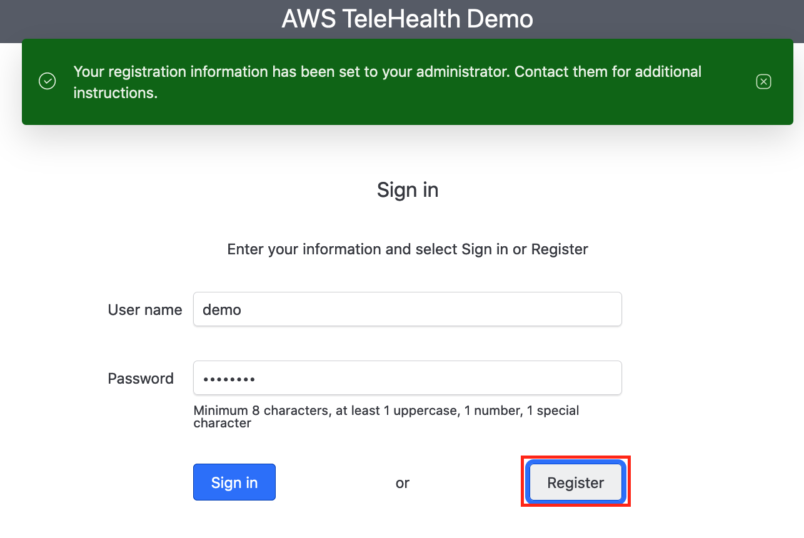
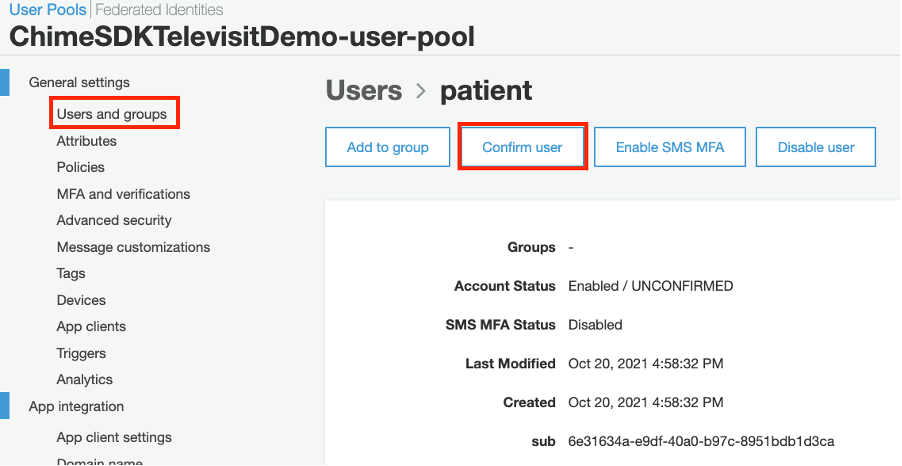
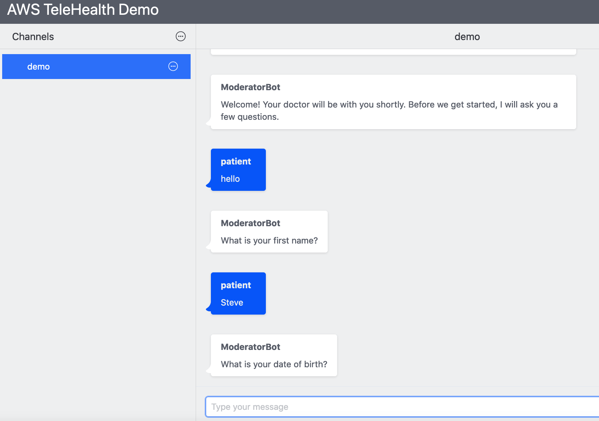
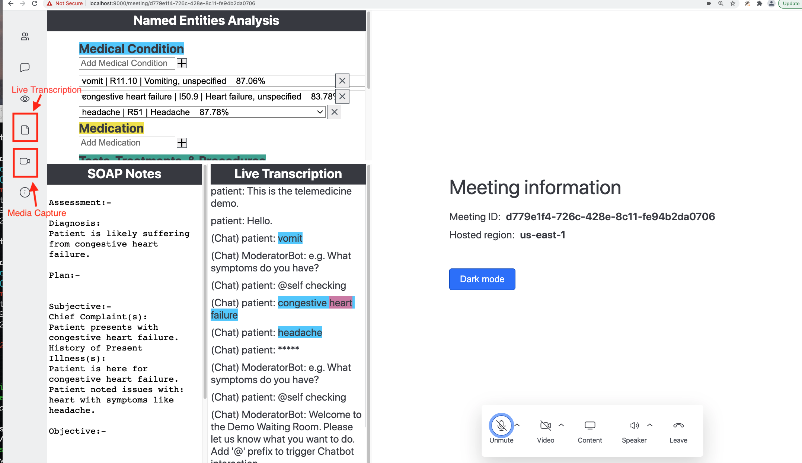

# Welcome to Amazon Chime SDK Televisit Demo

The diagram of architecture is here:



### Prerequisites

To deploy the serverless demo you will need:

- Node 10 or higher
- npm 6.11 or higher

And install aws and sam command line tools:

* [Install the AWS CLI](https://docs.aws.amazon.com/cli/latest/userguide/install-cliv1.html)
* [Install the AWS SAM CLI](https://docs.aws.amazon.com/serverless-application-model/latest/developerguide/serverless-sam-cli-install.html)

* Install [jq](https://stedolan.github.io/jq/), like:
```bash
npm install -g jq
```

### Run deployment script

You can run deploy.sh script in this folder to automatically deploy both frontend and backend stacks.

Alternatively, you can deploy backend and frontend manually: first go to backend folder and follow the README to deploy the CFN stack using AWS SAM CLI; then go to frontend folder and follow the READMD to build and deploy frontend stack. 

### Explore the televisit demo

1. Register a new user
<p align="center">
  
</p>

2. Confirm user registration on AWS Cognito console
<p align="center">
  
</p>

3. Create a new channel and interact with chatbot through Amazon Chime SDK chat
<p align="center">
  
</p>

4. Start a new meeting and try live transcription and media capture functions
<p align="center">
  
</p>

