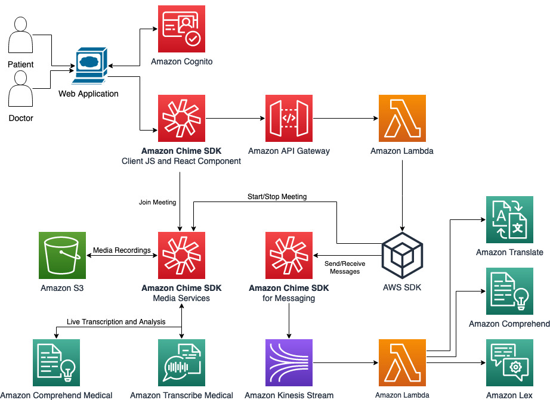

# Backend Infrastructure

The diagram of Architecture is here:



To build and deploy your application for the first time, run the following in your shell:

```bash
sam build
sam deploy --guided --capabilities CAPABILITY_NAMED_IAM 
```

When you deploy the template at first time, it will create a Amazon Chime App Instance through a Lambda function triggered by Custom Resource, so the parameter ChimeAppInstanceArn is not used. After first deployment, the ARN of Chime App Instance will be returned by Lambda function if the execution finished successfully, and it will be available in the Outputs of CFN stack. If the deployment suspends and waits for Custom Resource, please check the CloudWatch log of ChimeAppInstanceLambda function execution. 
The ChimeAppInstanceLambda function will use the parameter ChimeAppInstanceArn during the following updates of the same stack, so please provide the parameter ChimeAppInstanceArn from first time deployment when you update the same stack.

It is Okay to create Lambda functions without authorization defined during the guided SAM deployment, since the authorization is controled by Cognito authorized IAM role. So the first time guided deployment will look at this:

```
 Setting default arguments for 'sam deploy'
=========================================
Stack Name [sam-app]: 
AWS Region [us-east-1]: 
Parameter DemoName [ChimeSDKMessagingDemo]: 
Parameter ChimeAppInstanceArn [arn:aws:chime:us-east-1:<accountid>:app-instance/<isntanceid>]: 
#Shows you resources changes to be deployed and require a 'Y' to initiate deploy
Confirm changes before deploy [y/N]: 
#SAM needs permission to be able to create roles to connect to the resources in your template
Allow SAM CLI IAM role creation [Y/n]: 
CredApiFunction may not have authorization defined, Is this okay? [y/N]: Y
CreateMeetingApiFunction may not have authorization defined, Is this okay? [y/N]: Y
StartTranscriptionApiFunction may not have authorization defined, Is this okay? [y/N]: Y
CreateAttendeeApiFunction may not have authorization defined, Is this okay? [y/N]: Y
StartMeetingRecordingApiFunction may not have authorization defined, Is this okay? [y/N]: Y
StopMeetingRecordingApiFunction may not have authorization defined, Is this okay? [y/N]: Y
EndMeetingApiFunction may not have authorization defined, Is this okay? [y/N]: Y
Save arguments to configuration file [Y/n]: 
SAM configuration file [samconfig.toml]: 
SAM configuration environment [default]: 
```

This template will create several API Gateway endpoints handled by Lambda functions. Please check the CloudWatch logs for APIs and Lambda functions when things go wrong.
