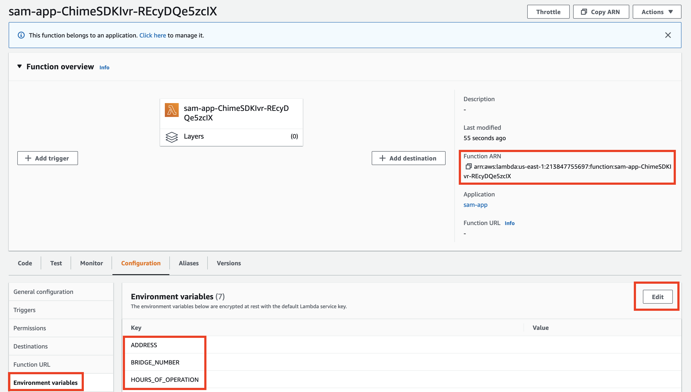

# Amazon Chime SDK PSTN Audio Basic IVR

This project contains source code and supporting files for a serverless application that you can deploy with the SAM CLI or through the Serverless Application Repository to create a basic Interactive Voice Response (IVR).

## Deploy the sample application

The Serverless Application Model Command Line Interface (SAM CLI) is an extension of the AWS CLI that adds functionality for building and deploying AWS Lambda applications.

Instructions for installing and using SAM can be found [here](https://docs.aws.amazon.com/serverless-application-model/latest/developerguide/serverless-sam-cli-install.html).

Once installed, instructions for deploying can be found [here](https://docs.aws.amazon.com/serverless-application-model/latest/developerguide/serverless-deploying.html).

## Adding Amazon Chime SDK PSTN Audio Resources

Once the Amazon Chime SDK SIP media application handler has been deployed, the Amazon Chime SDK resources can be deployed that will allow it to answer a phone call and interact with the caller.

- Public Switch Telephone Network (PSTN) phone number
- Amazon Chime SDK SIP media application
- Amazon Chime SDK SIP media application rule

For more information and details on how to create an Amazon Chime SDK PSTN Audio application, see [this AWS Workshop](https://catalog.us-east-1.prod.workshops.aws/workshops/30bd753c-9563-4c7c-8d1a-75460642550c). A brief list of the steps required are below.

### Configure Variables

Replace `<LAMBDA_ARN>` with the ARN of the Lambda created above.

```bash
AWS_ACCOUNT_ID=$(aws sts get-caller-identity --query Account --output text)
LAMBDA_ARN=<LAMBDA_ARN>
```

### Create SIP Media Application

```bash
SIP_MEDIA_APP_ID=$(aws chime create-sip-media-application --aws-region us-east-1 --name chimeSDKBasicIVR --endpoints LambdaArn=$LAMBDA_ARN --query "SipMediaApplication.SipMediaApplicationId" --output text)
```

### Provisioning a Phone Number

```bash
E164_PHONE_NUMBER=$(aws chime search-available-phone-numbers --country US --state FL --phone-number-type Local --max-results 1 --query E164PhoneNumbers --output text)

ORDER_ID=$(aws chime create-phone-number-order --product-type SipMediaApplicationDialIn --e164-phone-numbers $E164_PHONE_NUMBER --query PhoneNumberOrder.PhoneNumberOrderId --output text)
```

Once ordered, the phone number can take up to a few minutes to be acquired. To verify that it has been successfully acquired:

```bash
aws chime get-phone-number-order --phone-number-order-id $ORDER_ID
```

### Create SIP Media Application Rule

```bash
aws chime create-sip-rule --name chimeSdkPstnWorkshopSipRule --trigger-type ToPhoneNumber --trigger-value $E164_PHONE_NUMBER --target-applications SipMediaApplicationId=${SIP_MEDIA_APP_ID},Priority=1,AwsRegion=us-east-1
```

### Configuring Lambda Environment Variables

Once deployed, the AWS Lambda has several [Environment Variables](https://docs.aws.amazon.com/lambda/latest/dg/configuration-envvars.html) configured, but left empty. To use the sample IVR, these Environment Variables must be configured. These can be found in the AWS Lambda function indicated here.



- BRIDGE_NUMBER - The number to bridge your call to
- MAIN_MENU - Your main menu message, which is heard by the customer after the welcome message
- WELCOME_MESSAGE - The message which is heard by the customer once they connect to the call
- ADDRESS - Your address
- HOURS_OF_OPERATION - Your hours of operation

(optional)

- WAV_BUCKET - S3 Bucket with Ringback WAV file
- TONE_KEY - Ringback WAV file key

### Optional Ringback Tone

In order for the caller to hear a ringback tone while being connected during the CallAndBridge action, a wav file must be uploaded to an Amazon Simple Storage Service (Amazon S3) bucket. The below will create that bucket, apply an appropriate bucket policy, and copy a wav file to it.

```bash
aws s3api create-bucket --bucket "${AWS_ACCOUNT_ID}-chimesdkbasicivr"

aws s3api put-bucket-policy --bucket "${AWS_ACCOUNT_ID}-chimesdkbasicivr" --policy '{"Statement": [{"Sid": "SMARead","Effect": "Allow","Principal": {"Service": "voiceconnector.chime.amazonaws.com"},"Action":["s3:GetObject","s3:PutObject","s3:PutObjectAcl"],"Resource":"arn:aws:s3:::'${AWS_ACCOUNT_ID}'-chimesdkbasicivr/*","Condition":{"StringEquals":{"aws:SourceAccount":"'${AWS_ACCOUNT_ID}'"}}}]}'

aws s3 cp <RINGBACK_WAV_FILE> s3://${AWS_ACCOUNT_ID}-chimesdkbasicivr --content-type "audio/wav"
```

See [here](https://docs.aws.amazon.com/chime-sdk/latest/dg/play-audio.html) for more information on playing audio in an Amazon Chime SDK PSTN Audio application.
